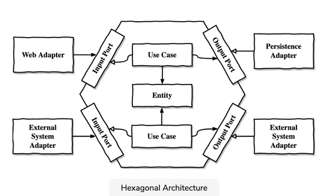

# Hexagonal Architecture
 - Notes from https://www.educative.io/courses/hexagonal-architecture-web-apps

### Goal of any application
- We are trying to create a model of the rules or policies that govern the business in order to make it easier for the users to interact with them

##  Problems with conventional layered Architecture

- Web --> domain --> persistence/database
- Database-Driven Design
- Everything is built on the top of database layer and is dependent on the database layer
- We make the database as foundation of our architecture instead of domain logic.
- When implementing new a usecase, we first think about the db structure and then domain logic to support   
- ORM tools creates a strong coupling between domain layer and the persistence layer.
  - Services use persistence model as their business model, it makes them worry about persistence related issues along with domain rules
  - Persistence code is virtually fused into the domain code and thus its hard to change one without the other
- Layered architecture promotes 
  - Prone to shortcuts: taking shortcuts as it do not enforce any rule on accessing components from any layer
    - We end up pushing logic down the stack for direct access. Create Helper, Util classes that do not belong to any layer 
  - Hard to Test: web layer can access domain layer etc
    - This makes unit tests harder to implement and we spend more time understanding and mocking that actually writing test code
  - Broad Services with many use cases, hard to decide where to add/update code
    - Instead of highly specialized narrow domain services that each served a single use case.
  - Parallel work is difficult
    - Broad services means editing same file by many devs causing merge conflicts
    - Database driven design will require domain+persistence logic completed before other engineers can work on layers above it

## Inverting Dependencies
- SOLID: S is Single Responsibility Principle.
  - Alternative definition is "A Component should have only one reason to change."
- In layered architecture, domain layer can change due to changes in the persistence layer. We need to reduce reasons to change domain code.  
- DIP: Dependency inversion principle 
  - We can turn around (invert) the direction of any dependency within our codebase
- Clean Architecture: Domain code must not have any outward-facing dependencies
- Domain layer is independent of any UI, persistence requirements.
  - That means domain layer will have to translate representations when sending or recieving data from the persistence layer

## Hexagonal Architecture Details
- 
- Domain Entities
  - Within the hexagon
  - No outward dependencies 
  - Usecases work with domain entities
- Adapters
  - Outside of the hexagon, we find various adapters that interact with the application
    - Web adapters interact with web browser
    - db adapter interacts with db
- Ports
  - To allow communication between the application core and the adapters, the application core provides specific ports.
  - For driving adapters(call our application core), such a port might be an interface that is implemented by one of the use case classes in the core and called by the adapter
  - For a driven adapter( they are called by our application core), it might be an interface that is implemented by the adapter and called by the core.

- Just like the Clean Architecture, we can organize this Hexagonal Architecture into layers. 
  - The outermost layer consists of the adapters that translate between the application and other systems. 
  - The application layer is formed of a combination of the ports and use case implementations as they define the interface of our application. 
  - The final layer contains the domain entities.

  - Name it Clean Architecture, Hexagonal Architecture, or Ports and Adapters Architecture — by inverting our dependencies so that the domain code has no dependencies to the outside, we can decouple our domain logic from all those persistence and UI specific problems and reduce the number of reasons to change throughout the codebase. Fewer reasons to change means better maintainability.
  - Independence 
- The domain code is free to be modeled as best fits the business problems while the persistence and UI code are free to be modeled as best fits the persistence and UI problems.
- In the rest of this course, we’ll apply the Hexagonal Architecture style to a web application. We’ll start by first creating the package structure of our application and then discussing the role of dependency injection.

